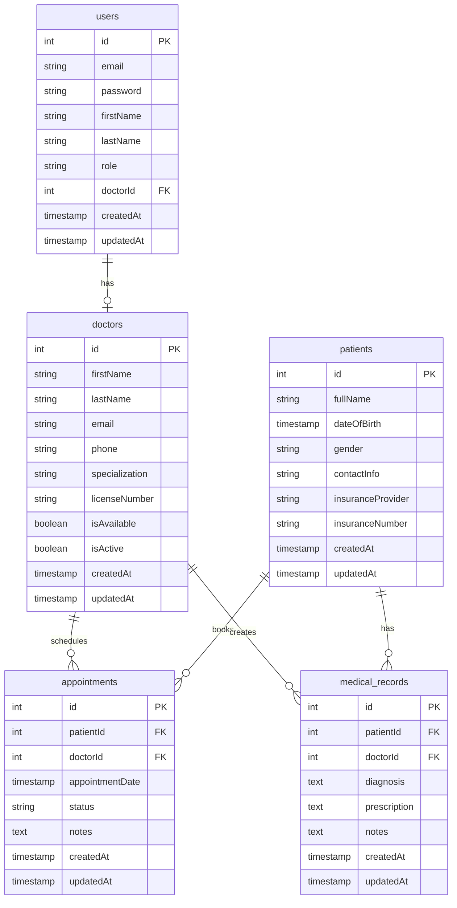
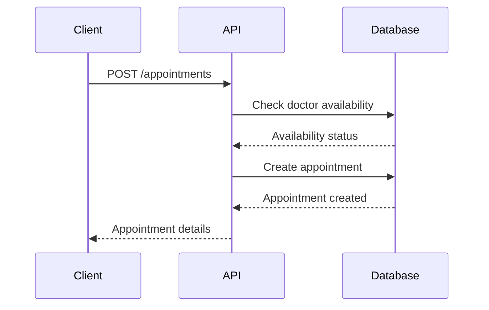
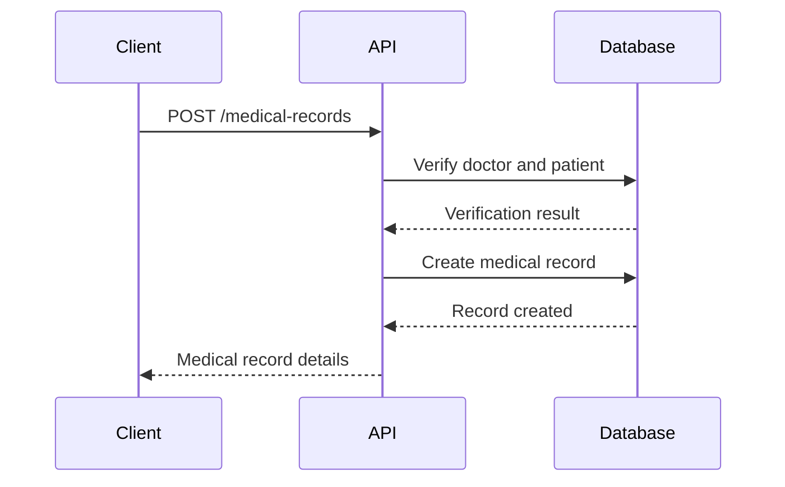

# Healthcare System API

A healthcare management system API built with Express.js, TypeScript, and PostgreSQL.

## Table of Contents
- [Setup Instructions](#setup-instructions)
- [API Documentation](#api-documentation)
- [Database Schema](#database-schema)
- [Sequence Diagrams](#sequence-diagrams)

## Setup Instructions

### Prerequisites
- Node.js (v18 or higher)
- PostgreSQL (v14 or higher)
- npm or yarn

### Installation Steps

1. Clone the repository:
```bash
git clone <repository-url>
cd healthcare-system/api
```

2. Install dependencies:
```bash
npm install
```

3. Create a PostgreSQL database:
```bash
createdb healthcare_db
```

4. Create a `.env` file in the root directory:
```env
# Database Configuration
DATABASE_URL="postgresql://localhost:5432/healthcare_db"

# admin user creation
ADMIN_CREATION_KEY="admin_user_creation_key"

# Server Configuration
PORT=3000
NODE_ENV=development

# JWT Configuration
JWT_SECRET="secret-jwt-key"
JWT_EXPIRES_IN="24h"

# CORS Configuration
CORS_ORIGIN="http://localhost:3000"

# Rate Limiting
RATE_LIMIT_WINDOW_MS=900000
RATE_LIMIT_MAX=100
```

5. Initialize the database:
```bash
# Generate migration files
npm run generate

# Apply migrations
npm run migrate

# Seed test data
npm run seed
```

6. Start the development server:
```bash
npm run dev
```

## API Documentation

### Authentication
All API endpoints except `/auth/login` require a valid JWT token in the Authorization header:
```
Authorization: Bearer <token>
```

### Endpoints

#### Authentication
- `POST /auth/login`
  - Request body: `{ email: string, password: string }`
  - Response: `{ token: string, user: User }`

#### Patients
- `GET /patients`
  - Query params: `page`, `limit`, `search`
  - Response: `{ patients: Patient[], total: number }`

- `GET /patients/:id`
  - Response: `Patient`

- `POST /patients`
  - Request body: `PatientCreate`
  - Response: `Patient`

- `PUT /patients/:id`
  - Request body: `PatientUpdate`
  - Response: `Patient`

- `DELETE /patients/:id`
  - Response: `{ success: boolean }`

#### Doctors
- `GET /doctors`
  - Query params: `page`, `limit`, `search`, `specialization`
  - Response: `{ doctors: Doctor[], total: number }`

- `GET /doctors/:id`
  - Response: `Doctor`

- `POST /doctors`
  - Request body: `DoctorCreate`
  - Response: `Doctor`

- `PUT /doctors/:id`
  - Request body: `DoctorUpdate`
  - Response: `Doctor`

- `DELETE /doctors/:id`
  - Response: `{ success: boolean }`

#### Appointments
- `GET /appointments`
  - Query params: `page`, `limit`, `patientId`, `doctorId`, `status`, `date`
  - Response: `{ appointments: Appointment[], total: number }`

- `GET /appointments/:id`
  - Response: `Appointment`

- `POST /appointments`
  - Request body: `AppointmentCreate`
  - Response: `Appointment`

- `PUT /appointments/:id`
  - Request body: `AppointmentUpdate`
  - Response: `Appointment`

- `DELETE /appointments/:id`
  - Response: `{ success: boolean }`

#### Medical Records
- `GET /medical-records`
  - Query params: `page`, `limit`, `patientId`, `doctorId`
  - Response: `{ records: MedicalRecord[], total: number }`

- `GET /medical-records/:id`
  - Response: `MedicalRecord`

- `POST /medical-records`
  - Request body: `MedicalRecordCreate`
  - Response: `MedicalRecord`

- `PUT /medical-records/:id`
  - Request body: `MedicalRecordUpdate`
  - Response: `MedicalRecord`

- `DELETE /medical-records/:id`
  - Response: `{ success: boolean }`

## Database Schema



## Sequence Diagrams

### Appointment Booking Flow


### Medical Record Creation Flow


## Available Scripts

- `npm run dev` - Start development server with hot reload
- `npm run generate` - Generate database migration files
- `npm run migrate` - Apply database migrations
- `npm run seed` - Seed database with test data
- `npm run studio` - Open Drizzle Studio for database management