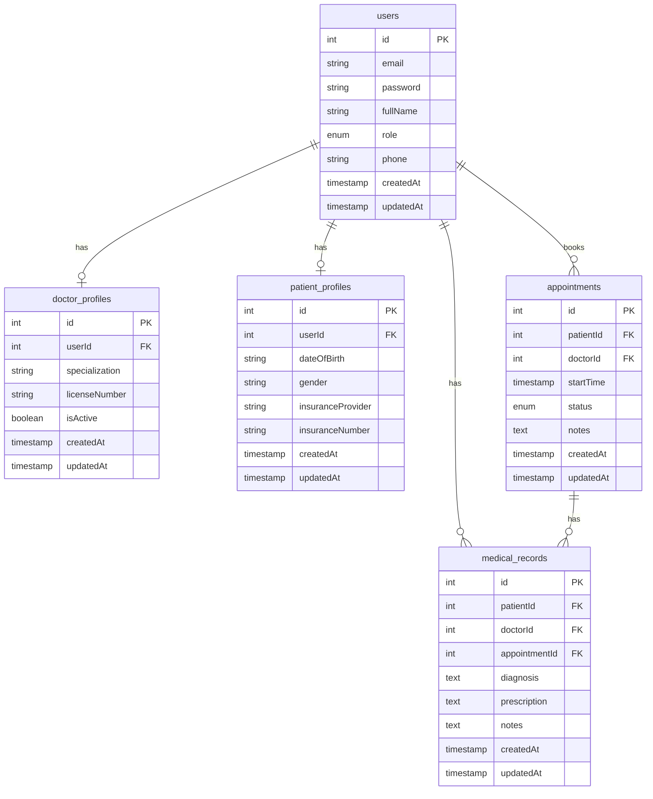

# Healthcare System API

A healthcare management system API built with Express.js, TypeScript, and PostgreSQL.

## Quick Start

## Setup Instructions

### Prerequisites
- Node.js (v18 or higher)
- PostgreSQL (v14 or higher)
- npm or yarn

### Installation Steps

1. Clone the repository:
```bash
git clone <repository-url>
cd healthcare-system/api
```

2. Install dependencies:
```bash
npm install
```

3. Create a PostgreSQL database:
```bash
createdb healthcare_db
```

4. Create a `.env` file in the root directory:
```env
# Database Configuration
DATABASE_URL="postgresql://localhost:5432/healthcare_db"

# Admin Configuration
ADMIN_CREATION_KEY="admin_user_creation_key"

# Server Configuration
PORT=3000
NODE_ENV=development

# JWT Configuration
JWT_SECRET="secret-jwt-key"
JWT_EXPIRES_IN="24h"

# CORS Configuration
CORS_ORIGIN="http://localhost:3000"

# Update DATABASE_URL and other variables in .env
```

3. **Initialize database:**
```bash
# Apply migrations
npm run migrate

# Seed test data
npm run seed
```

4. **Start development server:**
```bash
npm run dev
```

## API Documentation

### Authentication
All API endpoints except `/auth/login` and `/auth/register` require a valid JWT token in the Authorization header:
```
Authorization: Bearer <token>
```

### Endpoints

#### Authentication
- `POST /auth/register`
  - Request body: `{ email: string, password: string, firstName: string, lastName: string }`
  - Response: `{ token: string, user: User }`
  - Note: Creates a patient account by default

- `POST /auth/login`
  - Request body: `{ email: string, password: string }`
  - Response: `{ token: string, user: User }`

#### Users
- `GET /users/me`
  - Response: `User`

- `PUT /users/me`
  - Request body: `UserUpdate`
  - Response: `User`

#### Doctors (Admin Only)
- `POST /doctors`
  - Request body: `DoctorCreate`
  - Response: `Doctor`

- `GET /doctors`
  - Query params: `page`, `limit`, `search`, `specialization`
  - Response: `{ doctors: Doctor[], total: number }`

- `PUT /doctors/:id`
  - Request body: `DoctorUpdate`
  - Response: `Doctor`

#### Appointments
- `GET /appointments`
  - Query params: `page`, `limit`, `status`, `date`
  - Response: `{ appointments: Appointment[], total: number }`

- `POST /appointments`
  - Request body: `AppointmentCreate`
  - Response: `Appointment`

- `PUT /appointments/:id`
  - Request body: `AppointmentUpdate`
  - Response: `Appointment`

#### Medical Records (Optional)
- `GET /medical-records`
  - Query params: `page`, `limit`
  - Response: `{ records: MedicalRecord[], total: number }`

  ## Core Features
- 👥 User Management (patients, doctors, admins)
- 📅 Appointment Scheduling
- 🏥 Patient Records Management
- 👨‍⚕️ Doctor Profiles & Specializations
- 📋 Medical Records Tracking

## Database Schema



## Key API Endpoints
- 👥 User Management (patients, doctors, admins)
- 📅 Appointment Scheduling
- 🏥 Patient Records Management
- 👨‍⚕️ Doctor Profiles & Specializations
- 📋 Medical Records Tracking

## Sequence Diagrams

### User Registration Flow


### Appointment Booking Flow


## Available Scripts

- `npm run dev` - Start development server with hot reload
- `npm run generate` - Generate database migration files
- `npm run migrate` - Apply database migrations
- `npm run seed` - Seed database with test data
- `npm run studio` - Open Drizzle Studio for database management